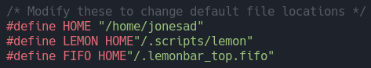
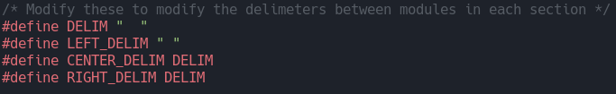
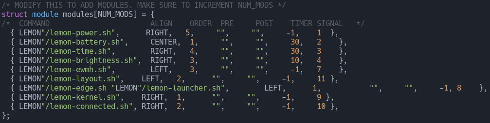
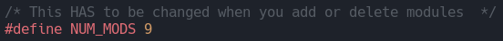
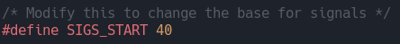

#LemonBro
## A suckless-inspired bar utility

## Overview ##

LemonBro is a piper program for lemonbar. What this means is that without [`lemonbar`](https://github.com/LemonBoy/bar) or one of its forks, this program just prints to stdout. To use the program, see [usage](#usage). By making this piping process into a C program rather than a shell script, it makes it easier to make efficient, minimalist bars that don't reinvent the wheel or use unnessecary compute cycle finding the current user every second.

## Usage
Modifying this program to fit your needs is a fairly straightforward process and only requires your favorite text editor and a C compiler (tested with GNU make). In order to do so, you have to modify the source code and recompile. However, for simplicities sake, most the of the configuration needed is done in the appropriate `config.h` file.
 
The first thing to be aware of is the script variables present in the following image:
 
The value of the following variables is useful because they set pre-set paths. `HOME` is used exclusively for the following two variables. `LEMON` is a shortcut to the directory where you have your scripts.
 
The second step is choosing which delimiters you want.
 
By changing either the `LEFT_DELIM`,`CENTER_DELIM`, or `RIGHT_DELIM` variables you can choose delimiters for each section of the bar. `DELIM` is simply a default you can use by setting the other variables with `#define x DELIM`.
 
The next step is to define which scripts to use as modules. The following image shows an example array (it's mine :D)
 
For a more in-depth explanation of each field, please see [modules](#Modules)
After adding these modules to the array, you have to modify the number of modules to the appropriate value (the number of rows in your modules array)
 
Finally, to start up the program you do the following shell commands: `./lemonbro | lemonbar` and/or `./lemonbrosecondary | lemonbar` depending on the whether it is a single bar or you are using both bars. 

## Modules

### Command
`modules[x][0]` is the command for the module. This can either be a shell script or can be direct commands. If properly configured, the `LEMON` variable when used as shown serves to eliminate the need for a path.

### Alignment
`modules[x][1]` places the widget onto a side of the bar. The values `LEFT`,`RIGHT`,`CENTER` refer to variables defined at the top of the `lemon.bro.c` file. These *do not* need to be changed.

### Order
`modules[x][2]` defines the order of the modules on its side. *This is 1 indexed and goes left to right*. Adding gaps in this order or starting at 0 <em>will</em> lead to undefined behavior.

### Prefix and Postfix
`modules[x][3]` gives a prefix for the command output (output of `modules[x][0]`). Useful for adding underlines or other lemonbar commands. 
`modules[x][4]` is the same as the prefix, just in post.

### Timer
`modules[x][5]` is the amount of time before the module updates. `-1` indicates the module will not auto-update.

### Signal
`modules[x][6]` provides an alternate method for updating a module. By sending a posix signal, with the signal number + the `SIG_START` (see picture below) variable as defined in `config.h`, the module will update. 

